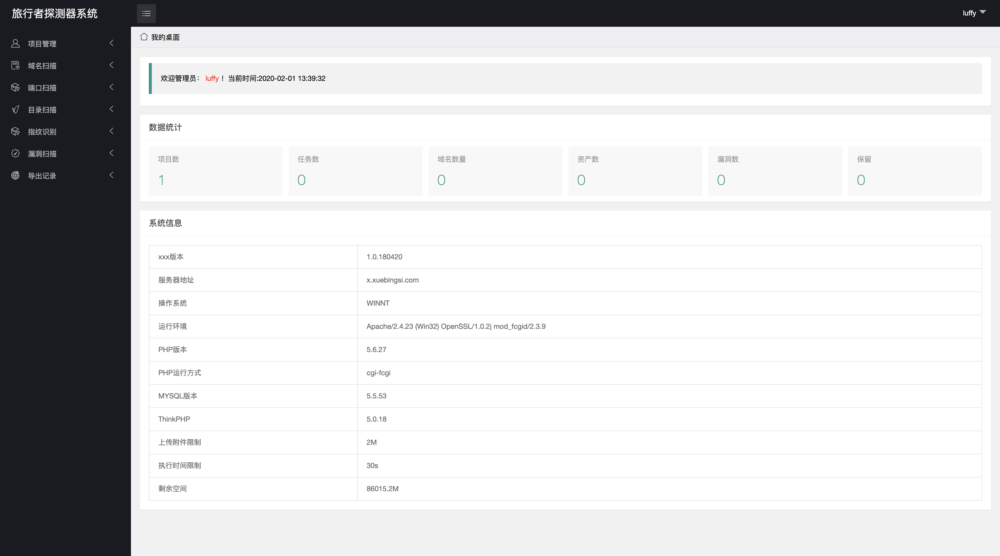
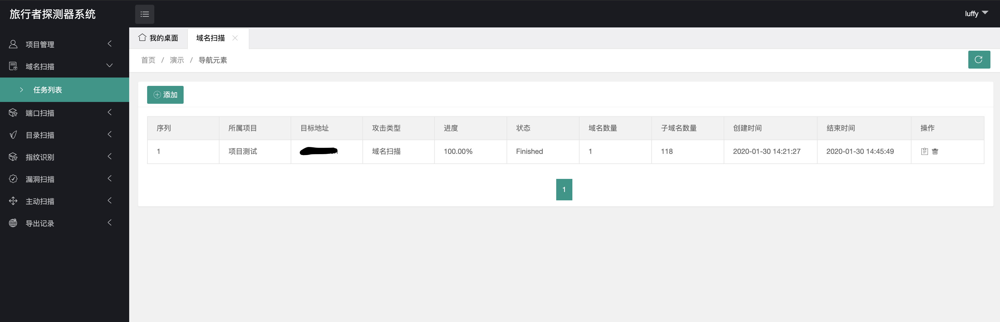
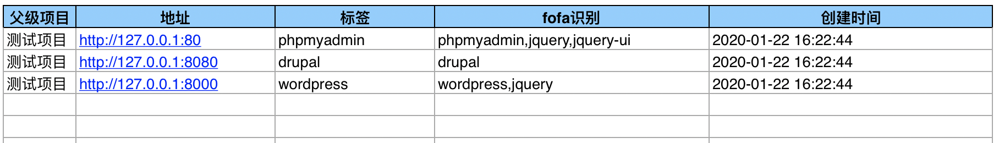
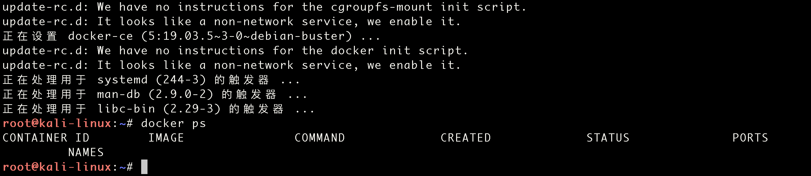
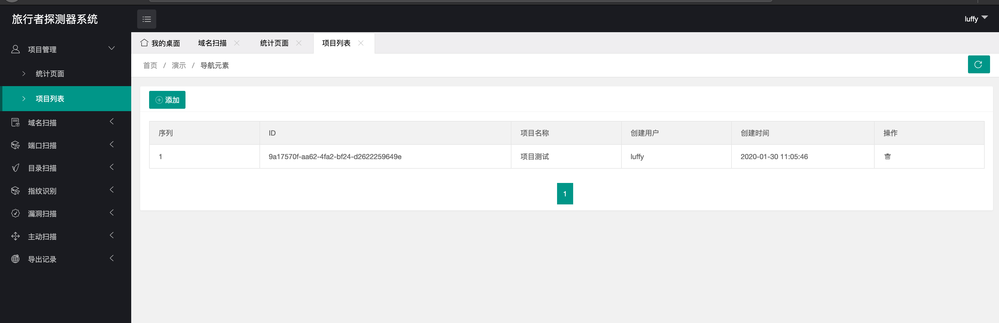

# 旅行者探测器系统


##  0x01 功能介绍
作为一个渗透人员，在每次渗透网站的时候都要拿出一堆黑客工具，比如nmap, awvs, 御剑等工具进行测试，由于实在厌烦了一些低级重复性的工作，趁着2020年新年创建了一个工具集合平台，将渗透测试常见的域名扫描，端口扫描，目录扫描，漏洞扫描的工具集合在一起

目前平台还在持续开发中，肯定有不少问题和需要改进的地方，欢迎大佬们提交建议和Bug，也非常欢迎各位大佬Star或者是Fork



**系统数据是伪造的**

## 0x02 系统结构

### 开发框架

基础语言: **Python(3.8.1)**

Web框架: **Flask(1.1.1)**

数据库: **Mongodb**

逻辑处理: **Docker**

前端: **Layui**

### 数据载入

数据流入有两种方式，一种是从WEB界面引入，还有一种是从上级任务引入，比如说端口扫描任务的IP既可以从WEB页面引入，也可以从域名扫描处获得。漏洞扫描的任务只能从端口扫描和域名扫描的任务中引入


## 0x02 功能介绍

### 0x001 域名扫描
采用的是[oneforall](https://github.com/shmilylty/OneForAll)，当前使用的版本是0.0.8,我修改了部分代码，使得工具和平台能够结合



### 0x002 端口扫描
程序采用的是[masscan](https://github.com/robertdavidgraham/masscan)和[nmap](https://github.com/nmap/nmap)结合的方式，先用masscan扫描开放的端口，然后再用nmap对开放的端口进行详细的信息探测，
这步是最重要的一步，通过nmap给端口打上标签，为以后的POC扫描提供数据，由于nmap只能识别广义的操作系统，中间件，数据库三层结构，再往上的web应用nmap无法识别，只能通过接下来的cms识别给web应用程序打标签

### 0x003 目录扫描
目录扫描采用的工具是[dirsearch](https://github.com/maurosoria/dirsearch),排除了部分bug并且扩充了字典然后进行封装

### 0x004 指纹识别
指纹识别采用的是新潮团队的[TideFinger](https://github.com/TideSec/TideFinger), 我提取出了TideFinger的指纹进行比对，原先TideFinger是单任务运行多线程请求的方式，为了配合框架我改成了多任务并发单线程请求的方式，由于Python3和Python2在字符编码上存在差异，导致相同的字符串可能会计算出不同的MD5值，这个指纹识别的库以后需要大量修改

导出的扫描结果


### 0x005 漏洞扫描
漏洞扫描功能现在引入了xunfeng和kunpeng的poc，一共144个，标签以nmap的标签为主，比如445端口的标签是microsoft-ds， 3389的标签是ms-wbt-server。这两个框架合并存在一定问题，比如说:xunfeng和kunpeng的poc主要针对非WEB应用，两个框架的POC存在重复的问题.我做了一定的去重工作，后期随着POC的增多，去重会是一个问题

### 0x006 WAF探测
分析了一下sqlmap的源代码，从中提取出了sqlmap用于WAF探测的代码并进行了封装, 用来探测类http端口是否有WAF保护，此功能并未在前台展示，一些模块比如目录扫描会自动进行调用

### 0x007 主动扫描
主动扫描用的是AWVS12，已经封装在Docker里了，通过AWVS12的restful进行API调用

## 0x03 安装教程

这里以Kali linux 2019.4作为基础操作系统

### 0x001 安装docker 
由于Kali默认没有安装Docker，需要手动安装

```bash
# curl -fsSL https://download.docker.com/linux/debian/gpg | apt-key add -
# echo 'deb [arch=amd64] https://download.docker.com/linux/debian buster stable' > /etc/apt/sources.list.d/docker.list
# apt-get update && apt-get install docker-ce
# systemctl enable docker
# systemctl start docker
```




### 0x002 下载源码安装

```bash
git clone https://github.com/ody5sey/Voyager.git
cd Voyager
bash run.sh
```
然后访问http://127.0.0.1:5000

默认的用户名和密码是luffy:s1riu5



正式开始前需要先创建一个项目

## 0x04 时间参数

**域名扫描**: 开启了爆破模式，一个域名大约需要25分钟

**端口扫描**: 服务器环境中百兆宽带内网测试将全C端，全端口的扫描压缩到10分钟之内，但是家用路由器根本无法承受如此巨大的负载，只好限制速度。现在单IP全端口扫描时间不到一分钟

**目录扫描**: 四个字典单个目标6分钟

## 0x05 TODO

权当是立FLAG吧

### 功能更新

- [ ] POC框架中引入bugscan和beebeeto，以改善针对WEB应用扫描不全的问题，这样四个主流POC框架的POC数量总计有1500+
- [ ] 引入AWVS12，首先对类http标签惊醒WAF测试,没有WAF保护的WEB应用将用AWVS的爬虫和xray进行检测
- [ ] 引入被动扫描器XRAY，和之前AWVS的一样，没有WAF保护的WEB应用将用AWVS的爬虫和xray进行检测
- [ ] 引入IP代理功能，为部分模块添加代理参数
- [ ] 引入Metasploit, 可以调用metasploit接口
- [ ] 引入爆破功能，本来想用hydra实现的，但是发现效果并不是很好，现在比较倾向于写爆破组件然后以插件的形式载入
- [ ] 引入一键日站功能，在输入IP地址或者是域名之后自动依次载入攻击组件
- [ ] 引入微信接口，从微信载入攻击目标然后后台自动攻击

### 长期更新

- [ ] 各组件的协调优化以及BUG修复, 漏报，误报的修复
- [ ] 指纹库的更新和poc库的更新

